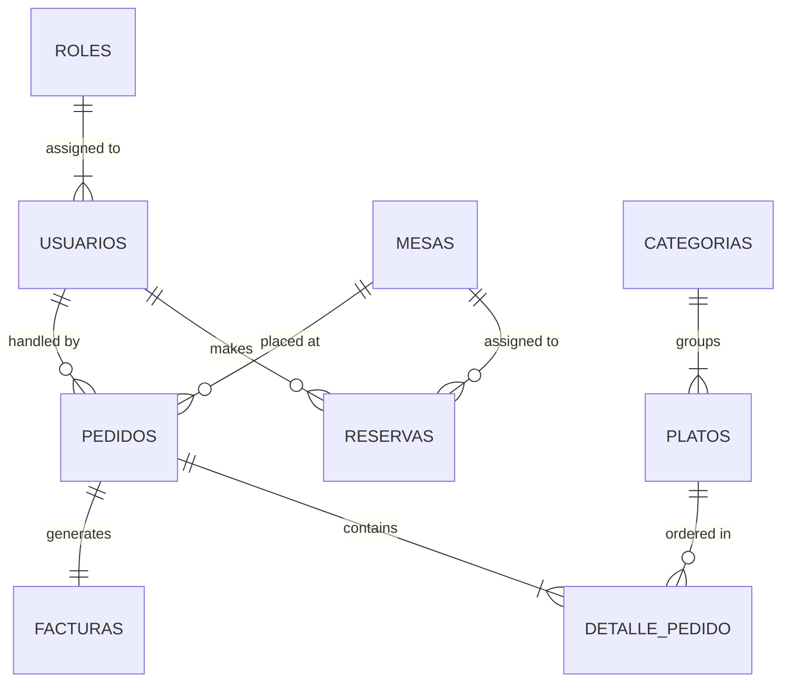

# 🍽️ RestoAPI


**RestoAPI** is an end-to-end management ecosystem engineered to automate manual restaurant operations for a restaurant located in the heart of Barcelona's **Sagrada Família** district (*Carrer d'Aragó*). 

This platform transitions the restaurant from paper tickets, physical notebooks, and manual ledger sheets into a scalable, real-time, cloud-native architecture.

---

## 📌 Table of Contents
- [1. Business Context & Location](#1-business-context--location)
- [2. Pain Points & Manual Processes Identified](#2-pain-points--manual-processes-identified)
- [3. Automated Software Solution](#3-automated-software-solution)
- [4. High-Level System Architecture](#4-high-level-system-architecture)
- [5. Database Design & Scalability](#5-database-design--scalability)
- [6. Project Structure](#6-project-structure)
- [7. Team Roles & Scrum Management](#7-team-roles--scrum-management)
- [8. API Endpoints Overview](#8-api-endpoints-overview)
- [9. Setup & Local Development](#9-setup--local-development)
- [10. CI/CD & Deployment Strategy](#10-cicd--deployment-strategy)

---

## 1. Business Context & Location

The restaurant is a bustling local spot situated along **Carrer d'Aragó**, just steps away from the iconic **Sagrada Família** in Barcelona. Serving both neighbourhood regulars and large daily influxes of international tourists, it works in a fast-paced environment.

Despite high customer demand, daily operations relied heavily on legacy pen-and-paper workflows, creating operational bottlenecks across the dining room, kitchen, and administrative office.

---

## 2. Pain Points & Manual Processes Identified

During the initial discovery phase, the engineering team identified four primary operational bottlenecks:

1. **Paper Orders & Kitchen Miscommunication:**
   * *Problem:* Waitstaff wrote orders on physical notepad tickets and manually carried them to the kitchen.
   * *Impact:* Lost tickets, unreadable handwriting, delayed orders, and lack of order status tracking during peak tourist hours.

2. **Manual Paper Notebook Reservations:**
   * *Problem:* Table reservations were logged into a physical book.
   * *Impact:* Double bookings, lack of real-time capacity control, no automated guest reminders, and frequent "no-shows."

3. **Manual Table Capacity & Occupancy Tracking:**
   * *Problem:* Waiters physically walked around the dining hall and terrace to check table availability.
   * *Impact:* Inefficient table turnaround times, misallocated seating, and poor customer experience.

4. **Spreadsheet Accounting & Receipt Generation:**
   * *Problem:* End-of-day billing and invoicing were calculated using manual spreadsheets and standalone cash registers.
   * *Impact:* Human error in daily accounting, slow checkout processes, and cumbersome tax reporting.

---

## 3. Automated Software Solution

**RestoAPI** replaces paper-based operations with an automated, synchronized web ecosystem:

* 📱 **Digital POS & Table Management (Waitstaff):** Allows waitstaff to take orders digitally per table, view floor-plan occupancy (interior, terrace, bar) in real time, and process seatings instantly.
* 🍳 **Real-Time Kitchen Display System (KDS):** Kitchen staff receive orders instantaneously via WebSocket connections as soon as a waiter sends a ticket.
* 📅 **Smart Reservation Engine & External Notifications:** Prevents double booking, checks real-time capacity, and automatically triggers transactional confirmation/cancellation emails using **Brevo API**.
* 📊 **Automated Billing & Reporting:** Closing a order auto-generates legal invoices (10% VAT computed) with CSV export functionality for accounting.
* 📈 **Analytics & Performance Caching:** Caches high-frequency queries (e.g., top-selling dishes, daily revenue) in memory to deliver instant business insights without overloading the database.

---

## 4. High-Level System Architecture

The project follows a decoupled, microservices-ready Monorepo architecture designed for seamless future horizontal scaling.

```
                  +-----------------------------------+
                  |   Client Web SPA (React + Vite)   |
                  |     Hosted on Vercel (CDN)        |
                  +-----------------+-----------------+
                                    |
                          HTTPS / REST / WebSocket
                                    |
                                    v
                  +-----------------+-----------------+
                  |      FastAPI Web Backend          |
                  |     Hosted on Render Cloud        |
                  +--------+----------------+---------+
                           |                |
                SQLAlchemy |                | Async HTTP
             (SSL Enforced)|                | (Background Tasks)
                           v                v
      +--------------------+----+      +---+-------------------+
      |  PostgreSQL Database    |      |  Brevo Email Service  |
      | Serverless (Neon.tech)  |      |   (Transactional)     |
      +-------------------------+      +-----------------------+
```

### Future Scalability Considerations
* **Stateless API Design:** Backend services authenticate via JWT, enabling multi-instance deployment behind a load balancer.
* **Separation of Read/Write Operations:** Database connections utilize connection pooling (Neon) ready for primary-replica read splitting.
* **Asynchronous Execution:** Non-blocking operations (e.g., transactional emails) execute in background task workers to maintain ultra-low API latency (<50ms response times).

---

## 5. Database Design & Scalability

The database is built on **PostgreSQL** with 9 normalized entities (3NF) ensuring strict data integrity, indexed foreign keys, and audit timestamps.



### Schema Entity Overview
1. **`roles`**: Defines access permissions (`admin`, `camarero`, `cocina`, `cliente`).
2. **`usuarios`**: Central user repository with encrypted passwords (`bcrypt`).
3. **`mesas`**: Physical table inventory (number, capacity, location: *interior, terraza, barra*, status).
4. **`reservas`**: Booking logs with duration, guest count, and collision prevention.
5. **`categorias`**: Menu groupings (e.g., *Starters, Mains, Desserts, Beverages*).
6. **`platos`**: Menu items with prices, allergen listings, and availability flags.
7. **`pedidos`**: Orders linked to tables and waitstaff, with status lifecycle (`pendiente` ➔ `en_cocina` ➔ `servido` ➔ `pagado`).
8. **`detalle_pedido`**: Line items per order capturing historical price snapshot.
9. **`facturas`**: Legal tax invoices (10% VAT, unique reference numbers like `F-2026-00001`).

---

## 6. Project Structure

```text
restoapi/
├── .github/
│   └── workflows/
│       ├── ci.yml              # CI workflow: Ruff linting, Pytest DB tests, Frontend build
│       └── deploy.yml          # CD workflow: Auto-trigger Render & Vercel deployment
├── backend/
│   ├── alembic/                # Database migrations
│   ├── app/
│   │   ├── core/               # Security (JWT), Config, DB, Logging, Exceptions
│   │   ├── models/             # SQLAlchemy ORM Models
│   │   ├── schemas/            # Pydantic validation schemas
│   │   ├── routers/            # API Route Handlers (Auth, Users, Tables, Menu, etc.)
│   │   ├── services/           # Business logic & external integrations (Brevo)
│   │   ├── websockets/         # Kitchen WebSocket broadcasting endpoint
│   │   └── main.py             # FastAPI entrypoint
│   ├── tests/                  # Integration and Unit tests (Pytest + HTTPX)
│   ├── Dockerfile
│   └── requirements.txt
├── frontend/
│   ├── src/
│   │   ├── api/                # Axios instance & TypeScript definitions
│   │   ├── components/         # Reusable UI elements
│   │   ├── context/            # AuthContext provider
│   │   └── pages/              # Views (Login, Tables, Kitchen KDS, Billing, Admin)
│   ├── package.json
│   └── vercel.json
├── docs/
│   ├── er-diagram.png          # High-resolution ER diagram
│   ├── api.md                  # API Endpoint documentation
│   └── deploy.md               # Infrastructure setup guide
├── docker-compose.yml          # Multi-container local execution setup
└── README.md
```

---

## 7. Team Roles & Scrum Management

The project was delivered over 2 sprints (10 working days) by a multidisciplinary team of 4 engineers following SCRUM methodology:

| Team Member | Technical Role | Core Responsibilities |
| :--- | :--- | :--- |
| **Anna** | DevOps / Cloud & Frontend Lead | Docker, CI/CD Pipelines, Render/Vercel/Neon deployment, React SPA UI |
| **Carla** | Backend Core & Security | FastAPI initialization, JWT Authentication, RBAC Middleware, Invoicing & CSV |
| **Rita** | Scrum Master & Menu/Orders Lead | SCRUM facilitation, Kanban board, Menu API, Orders engine, WebSockets, Analytics |
| **Levi** | Database, Reservations & QA Lead | Table inventory, Collision-free Reservation engine, Brevo Email Service, Pytest Suite |

---

## 8. API Endpoints Overview

| Module | Method | Endpoint | Description | Access |
| :--- | :--- | :--- | :--- | :--- |
| **Auth** | `POST` | `/auth/login` | Authenticate user & return JWT token | Public |
| **Users** | `GET / POST` | `/usuarios` | Manage staff and customer profiles | Admin |
| **Tables** | `GET / POST` | `/mesas` | View and edit physical table layout | Admin / Staff |
| **Reservations** | `POST` | `/reservas` | Book a table (Triggers Brevo confirmation email) | All |
| **Menu** | `GET / POST` | `/platos` | Filterable list of menu items with pagination | Public / Admin |
| **Orders** | `POST` | `/pedidos` | Create kitchen order ticket for a table | Waitstaff |
| **Kitchen WS** | `WS` | `/ws/cocina` | Real-time WebSocket connection for kitchen display | Kitchen / Admin |
| **Billing** | `POST` | `/facturas/desde-pedido/{id}` | Close order and generate tax invoice | Waitstaff / Admin |
| **Analytics** | `GET` | `/estadisticas/ventas` | Cached daily sales and popular dishes report | Admin |

---

## 9. Setup & Local Development

### Prerequisites
* [Docker](https://www.docker.com/) & Docker Compose
* [Python 3.12+](https://www.python.org/)
* [Node.js 20+](https://nodejs.org/)

### Quickstart with Docker Compose (Recommended)
1. Clone the repository:
   ```bash
   git clone https://github.com/your-org/restoapi.git
   cd restoapi
   ```
2. Copy the environment template:
   ```bash
   cp backend/.env.example backend/.env
   ```
3. Spin up the entire stack (API, PostgreSQL, and Frontend):
   ```bash
   docker-compose up --build
   ```
4. Access the applications:
   * **Frontend UI:** `http://localhost:5173`
   * **FastAPI Interactive Docs (Swagger):** `http://localhost:8000/docs`
   * **Health Check:** `http://localhost:8000/health`

---

## 10. CI/CD & Deployment Strategy

* **CI Pipeline (`ci.yml`):** Automatically runs on pull requests to `dev` or `main`. It executes `ruff` linting, database migrations against a test PostgreSQL instance, and unit/integration tests with a mandatory `≥70%` coverage threshold.
* **CD Pipeline (`deploy.yml`):** On merge to `main`, GitHub Actions triggers auto-deployment hooks to **Render** (API Service) and **Vercel** (Frontend SPA), connected to **Neon Serverless PostgreSQL**.

---
*Developed with ❤️ by Team RestoAPI — Barcelona.*