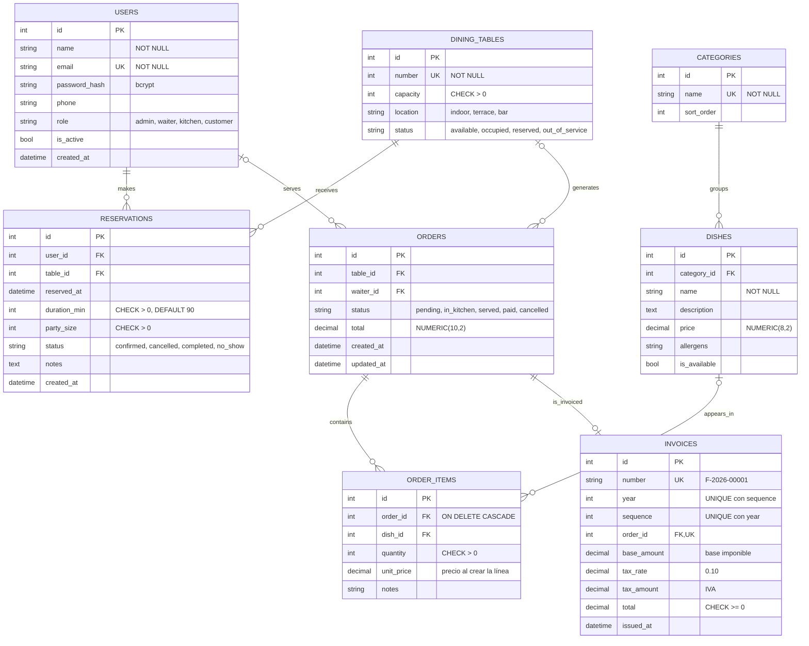

# RestoAPI · Diagrama entidad-relación final

Versión final del diagrama ER del plan del proyecto (§3.3), con las tablas tal como están en
los modelos SQLAlchemy de `app/models/`. Las tablas se crean con `create_all` al arrancar (no
hay migraciones). Imagen exportada: [`er-diagram.png`](er-diagram.png).

## Cambios respecto al plan

El plan tenía 9 tablas; el modelo final tiene **8**.

| Tabla | Plan (§3.1) | Final | Motivo |
|---|---|---|---|
| `roles` | Tabla propia, con `users.role_id` → `roles.id` | No existe. El rol es la columna `users.role` y sus valores salen del enum `Role` (`app/models/model_user.py`) | Los 4 roles son fijos: un enum es más simple y no necesita sembrar la tabla |
| `invoices` | `subtotal`, `tax`, `payment_method` | `base_amount`, `tax_rate`, `tax_amount`, `year`, `sequence`; sin `payment_method` | Nombres más claros, IVA guardado por si cambia el tipo, numeración que se reinicia cada año (`UNIQUE (year, sequence)`). El método de pago no entró en la HU-14 |
| `orders` | `table_id` y `waiter_id` obligatorios en la relación | Admiten `NULL` | Así quedó el modelo de pedidos; el camarero se guarda al crear el pedido (HU-05) |
| `orders` → `order_items` | Al menos una línea (`\|\|--\|{`) | Puede no tener líneas (`\|\|--o{`) | La API no exige un mínimo de líneas al crear el pedido |
| `dishes` | `price CHECK ≥ 0` | Sin `CHECK` en la BD | La validación de precio está en la API |
| `orders.status` | Valores fijos | Sin `CHECK` en la BD | Los valores se validan en la API (`Literal` en el esquema) |

Las demás tablas (`users`, `dining_tables`, `reservations`, `categories`, `order_items`) siguen
el plan, con `CHECK` en la BD para `capacity`, `location`, los `status` de mesas y reservas,
`party_size`, `duration_min` y `quantity`.

## Notas

- **`dining_tables`:** se llama así porque `table` es palabra reservada de SQL.
- **Precio histórico:** `order_items.unit_price` guarda el precio del plato al crear la línea.
  Si después cambia `dishes.price`, los pedidos, las facturas y las estadísticas no cambian.
- **Estadísticas (HU-15):** no tienen tabla propia. Se calculan sobre `orders` y `order_items`
  (pedidos `served` y `paid`) y se guardan en una caché en memoria.
- **Regenerar la imagen** si cambia el modelo: pegar el bloque Mermaid en
  [mermaid.live](https://mermaid.live), exportar como PNG y guardarlo en `docs/er-diagram.png`.
  